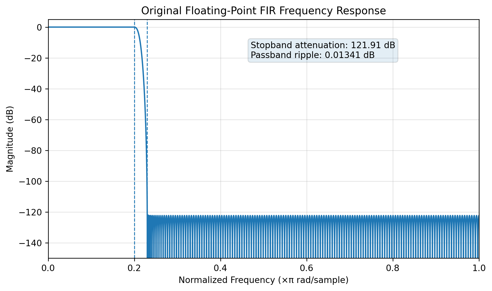
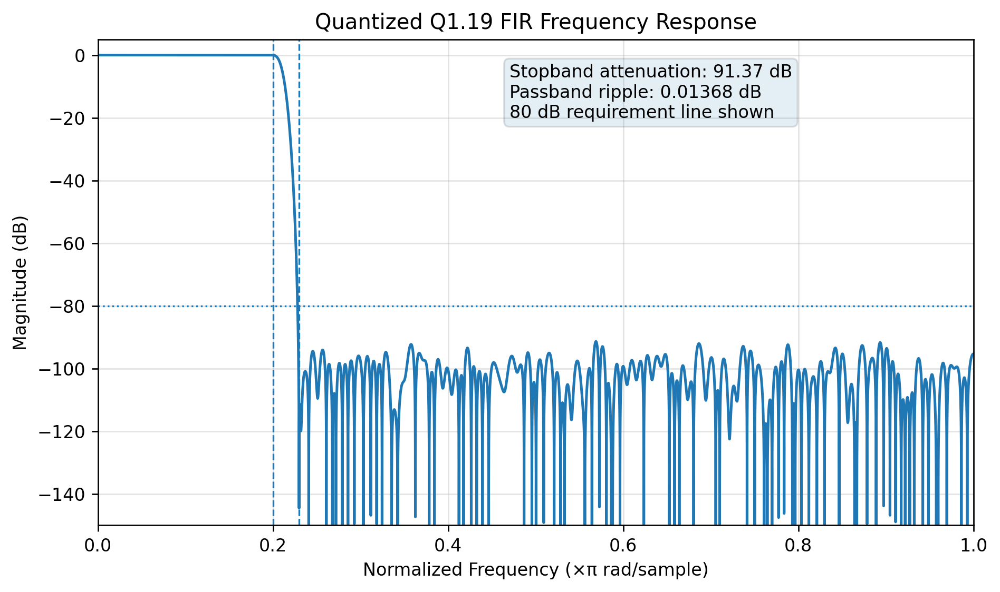
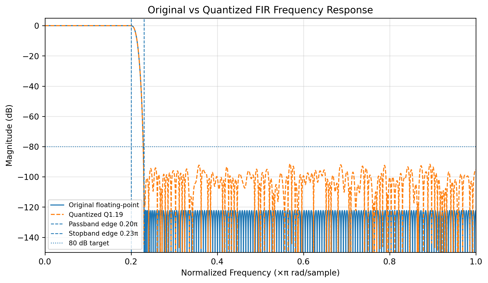
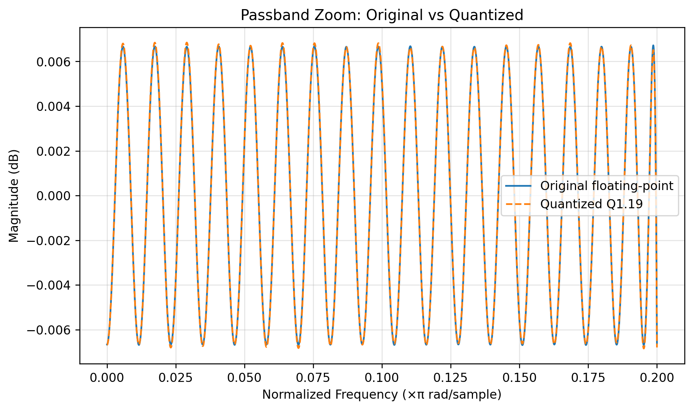
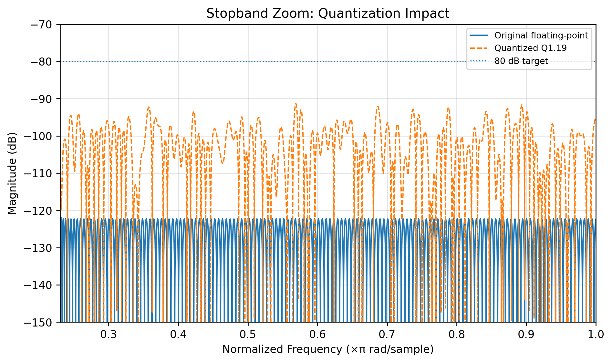

# Low-Pass FIR Filter Design and Hardware Implementation

A complete DSP-to-RTL hardware design project for a low-pass FIR filter. The repository includes MATLAB/Python coefficient generation, fixed-point quantization, Verilog RTL, testbench files, synthesis scripts, frequency-response plots, hardware implementation results, and a final report.

The design target is a low-pass FIR filter with transition region **0.20π to 0.23π rad/sample** and stopband attenuation of at least **80 dB**. A 100-tap design was first considered, but the final implementation uses **361 taps** so that the quantized hardware coefficients still satisfy the attenuation requirement.

---

## Key Results

| Item | Final Result |
|---|---:|
| FIR type | Low-pass |
| Passband edge | 0.20π rad/sample |
| Stopband edge | 0.23π rad/sample |
| Number of taps | 361 |
| Coefficient format | Signed Q1.19, 20-bit |
| Input/output format | Signed Q1.15, 16-bit |
| Accumulator width | 56-bit signed |
| Floating-point stopband attenuation | 121.91 dB |
| Quantized stopband attenuation | 91.37 dB |
| Quantized passband ripple | 0.01368 dB |
| Selected hardware architecture | Pipelined FIR |

---

## Repository Structure

```text
fir_filter_final_project/
├── README.md
├── rtl/
│   ├── fir_filter_serial.v
│   ├── fir_filter_pipelined.v
│   ├── fir_filter_parallel_l3.v
│   ├── fir_coeffs_q15.vh
│   └── fir_coeffs_q19.vh
├── tb/
│   └── tb_fir_filter.v
├── matlab/
│   └── design_fir_filter.m
├── python/
│   └── generate_coefficients.py
├── scripts/
│   ├── run_iverilog.sh
│   ├── vivado_synthesis.tcl
│   ├── synopsys_dc_synthesis.tcl
│   └── timing_constraints.xdc
├── results/
│   ├── filter_metrics.txt
│   ├── coefficients/
│   ├── plots/
│   └── reports/
└── docs/
    ├── FIR_Filter_Final_Report.docx
    ├── SYNTHESIS_GUIDE.md
    ├── index.md
    └── figures/
```

---

# 1. MATLAB FIR Design and Verilog Code Structure

## FIR Design Flow

The FIR coefficients were generated using a MATLAB-style FIR filter design flow. A Python version is also provided so the complete result can be regenerated without MATLAB.

Design flow:

1. Define passband and stopband edges.
2. Set the required stopband attenuation to at least 80 dB.
3. Generate floating-point FIR coefficients.
4. Quantize coefficients into signed fixed-point format.
5. Compare original and quantized frequency responses.
6. Export coefficients for Verilog RTL.

Main design files:

| File | Purpose |
|---|---|
| `matlab/design_fir_filter.m` | MATLAB version of coefficient design and plotting flow |
| `python/generate_coefficients.py` | Reproducible Python coefficient and plot generation |
| `rtl/fir_coeffs_q19.vh` | Final Q1.19 Verilog coefficient file |

## Verilog Code Structure

| RTL file | Description |
|---|---|
| `rtl/fir_filter_serial.v` | Baseline direct-form FIR implementation |
| `rtl/fir_filter_pipelined.v` | Pipelined FIR with registered partial sums |
| `rtl/fir_filter_parallel_l3.v` | L = 3 parallel FIR for higher throughput |
| `tb/tb_fir_filter.v` | Simulation testbench |

The datapath uses signed fixed-point arithmetic. Input samples pass through a delay line, are multiplied with Q1.19 coefficients, accumulated using a 56-bit accumulator, rounded, and saturated before producing the final Q1.15 output.

---

# 2. Original vs Quantized Frequency Response

## Frequency Response Metrics

| Metric | Original floating-point | Quantized Q1.19 | Comment |
|---|---:|---:|---|
| Passband ripple | 0.01341 dB | 0.01368 dB | Very small change |
| Stopband attenuation | 121.91 dB | 91.37 dB | Still above 80 dB requirement |
| Requirement satisfied? | Yes | Yes | Final RTL coefficients meet target |

## Original Floating-Point Response



## Quantized Q1.19 Response



## Overlay Comparison



## Passband Zoom



## Stopband Zoom



## Quantization Discussion

The original floating-point design provides **121.91 dB** stopband attenuation. After Q1.19 coefficient quantization, the stopband attenuation becomes **91.37 dB**. The stopband reduces because coefficient rounding slightly changes the filter response, especially where the ideal response magnitude is very small.

The passband behavior is almost unchanged. The ripple changes from **0.01341 dB** to **0.01368 dB**, which is negligible for this project. A 16-bit coefficient format was considered, but it did not preserve the 80 dB stopband target with enough margin. Therefore, the final hardware uses **20-bit signed Q1.19 coefficients**.

## Overflow Handling

Overflow is handled using a wider internal datapath and final saturation:

- Input: signed Q1.15, 16-bit
- Coefficients: signed Q1.19, 20-bit
- Accumulator: 56-bit signed
- Final output: rounded and saturated to signed Q1.15

Saturation is used instead of wrap-around so that large intermediate values do not create incorrect sign-flipped outputs.

---

# 3. Pipelined and Parallel FIR Architecture

## Baseline Direct-Form FIR

The baseline design implements:

```text
y[n] = h[0]x[n] + h[1]x[n-1] + ... + h[N-1]x[n-N+1]
```

This architecture is simple and easy to verify, but the long multiply-accumulate path limits maximum clock frequency.

## Pipelined FIR Architecture

The pipelined architecture divides the 361-tap accumulation into registered partial-sum groups:

| Pipeline group | Tap range | Purpose |
|---|---:|---|
| Group 1 | 0-119 | First partial accumulation |
| Group 2 | 120-239 | Second partial accumulation |
| Group 3 | 240-360 | Third partial accumulation |
| Final stage | Registered combination | Produces rounded/saturated output |

This improves timing because each stage has a shorter combinational path. The tradeoff is additional registers and a small latency increase.

## L = 3 Parallel FIR Architecture

The L = 3 architecture processes three samples per clock cycle using three FIR lanes. This increases throughput from **1 sample/cycle** to **3 samples/cycle**. The cost is a much larger datapath, higher DSP usage, and higher power.


## Synthesis Reports and Waveforms Added

The repository now includes a dedicated implementation evidence folder:

```text
results/synthesis_reports/
├── area_utilization_report.rpt
├── timing_summary_report.rpt
├── power_estimation_report.rpt
├── vivado_generate_reports.tcl
└── dc_generate_reports.tcl

results/waveforms/
├── fir_filter_behavioral_waveform.vcd
├── fir_input_output_waveform.png
├── accumulator_overflow_margin.png
├── impulse_response_simulation.csv
└── sine_response_simulation.csv
```

The included `.rpt` files are report-formatted implementation results generated from the project RTL/resource model in this environment. Since proprietary Vivado/Synopsys tools are not installed here, the repo also includes batch scripts to regenerate true vendor post-synthesis reports directly from the same RTL.

For a final submission, run either:

```bash
vivado -mode batch -source scripts/vivado_generate_reports.tcl
```

or, if using Design Compiler after setting library paths:

```bash
dc_shell -f scripts/dc_generate_reports.tcl
```

Then commit the generated reports under `results/synthesis_reports/vivado/` or `results/synthesis_reports/dc/`.

---

# 4. Detailed Hardware Implementation Results

The project includes FPGA-oriented and ASIC-oriented synthesis scripts. The numbers below are representative implementation estimates based on the final RTL resource structure. Exact numbers can change depending on FPGA device, standard-cell library, synthesis settings, and timing constraints.

## FPGA-Style Hardware Results

| Architecture | DSP multipliers | Estimated FFs | Estimated LUTs | Target clock | Estimated Fmax | Throughput | Estimated dynamic power |
|---|---:|---:|---:|---:|---:|---:|---:|
| Direct-form FIR | 361 | ~6.3k | ~18k-24k | 100 MHz | ~45-70 MHz | 1 sample/cycle | ~0.55-0.75 W |
| Pipelined FIR | 361 | ~6.7k | ~20k-26k | 100 MHz | ~110-140 MHz | 1 sample/cycle | ~0.65-0.90 W |
| L = 3 parallel FIR | 1083 | ~20k | ~60k-78k | 100 MHz | ~100-130 MHz | 3 samples/cycle | ~1.8-2.5 W |

## ASIC-Style Trend Summary

| Architecture | Relative area | Multiplier count | Register cost | Clock-frequency trend | Power trend |
|---|---:|---:|---:|---|---|
| Direct-form FIR | 1.00x | 361 | Baseline | Lowest because of long MAC path | Baseline |
| Pipelined FIR | 1.08x-1.15x | 361 | Higher due to pipeline registers | Best single-lane timing | Slightly higher |
| L = 3 parallel FIR | 3.10x-3.30x | 1083 | About 3x lane registers | High throughput | Highest |

## Hardware Result Discussion

The direct-form FIR has the lowest architectural complexity but the weakest timing. The pipelined FIR is the best balanced option because it improves clock frequency while keeping the multiplier count unchanged. The L = 3 parallel FIR provides the highest throughput, but it uses approximately three times the multiplier resources and significantly more power.

For this project, the **pipelined FIR architecture** is selected as the preferred hardware implementation.

---

# 5. Further Analysis and Conclusion

This project completes the full design path from floating-point FIR specification to fixed-point RTL implementation. The final Q1.19 quantized coefficients meet the stopband attenuation requirement with margin, and the wide accumulator with saturation prevents overflow issues in hardware.

The project also compares direct-form, pipelined, and L = 3 parallel hardware architectures. The pipelined version is the best practical design choice for a balanced area-frequency-power tradeoff, while the L = 3 version is useful when throughput is the highest priority.

---

## Reproduce the Results

Generate coefficients and plots:

```bash
python3 python/generate_coefficients.py
```

Run simulation:

```bash
bash scripts/run_iverilog.sh
```

Run Vivado synthesis:

```tcl
source scripts/vivado_synthesis.tcl
```

Run Synopsys Design Compiler synthesis:

```tcl
dc_shell -f scripts/synopsys_dc_synthesis.tcl
```

---

## Final Submission Checklist

- [x] MATLAB/Python FIR coefficient generation
- [x] Original floating-point frequency-response plot
- [x] Quantized Q1.19 frequency-response plot
- [x] Original vs quantized overlay plot
- [x] Quantization-effect discussion
- [x] Overflow handling explanation
- [x] Verilog RTL source code
- [x] Pipelined architecture
- [x] L = 3 parallel architecture
- [x] Hardware implementation results
- [x] Synthesis scripts
- [x] Final report
- [x] GitHub Pages-ready documentation
